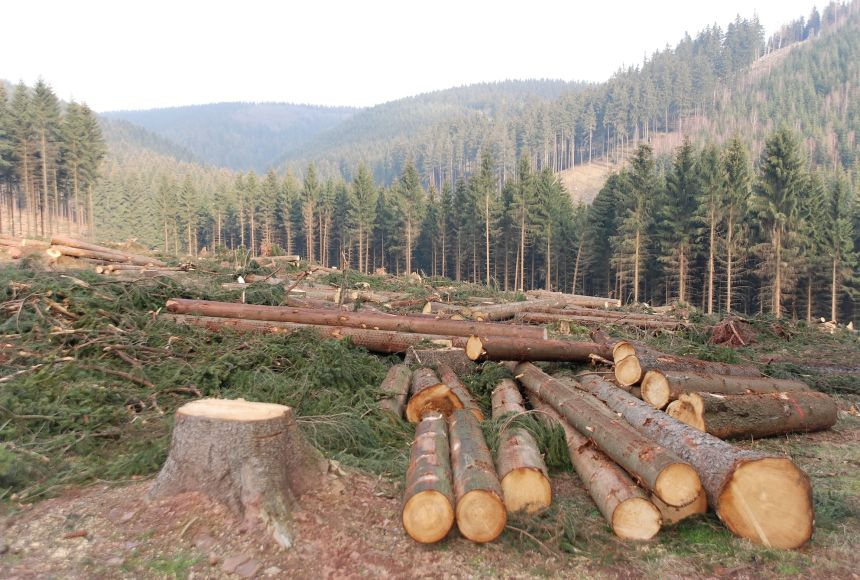
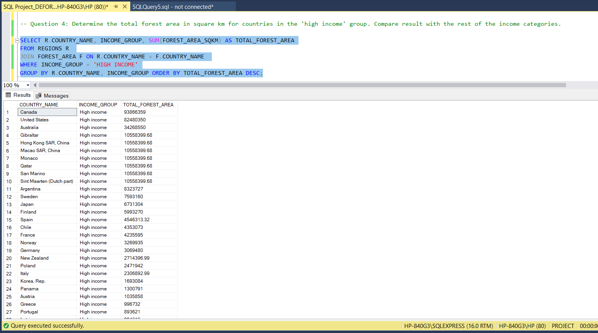
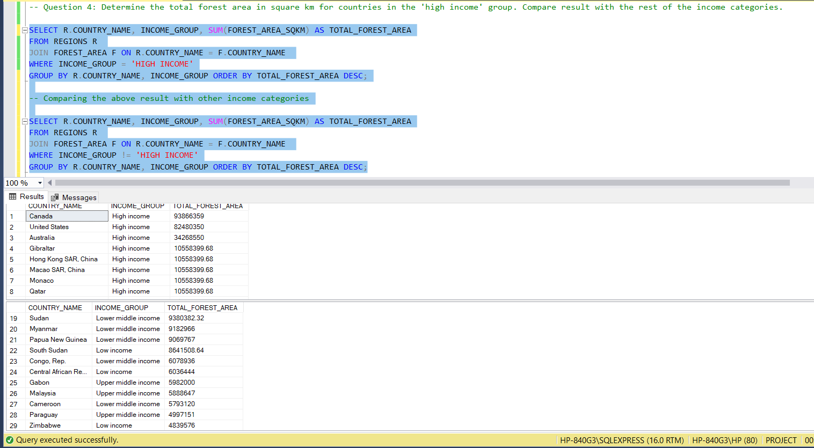
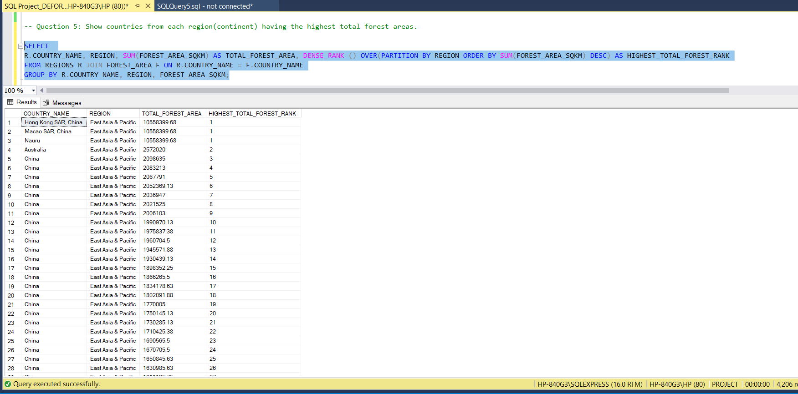
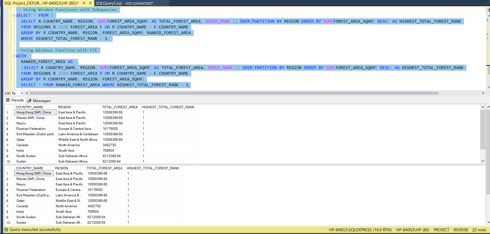
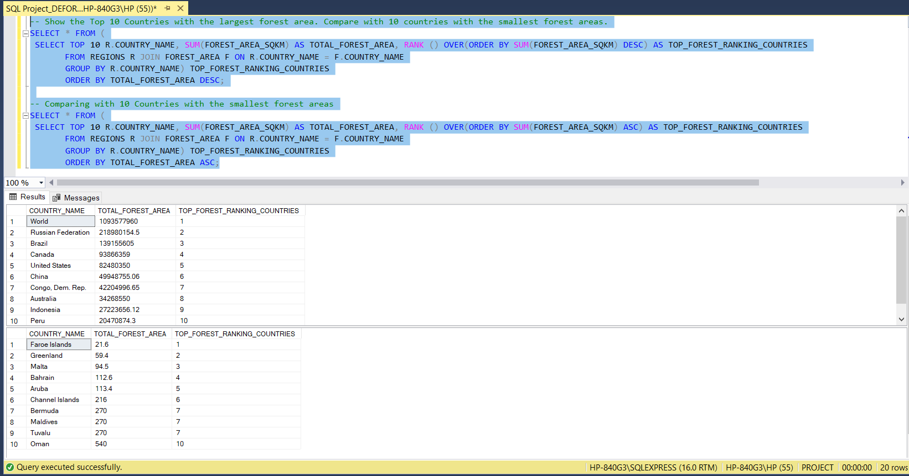

# Comprehensive Analysis of Deforestation – Environmental and Economic Implications

Image Link: https://images.nationalgeographic.org/image/upload/t_edhub_resource_key_image/v1652341008/EducationHub/photos/deforestation.jpg

## Introduction
Deforestation refers to the clearing, removal, or destruction of forests, primarily due to human activities like logging, agriculture, or urban expansion. It is a significant environmental concern as it leads to habitat loss, climate change, disruption of ecosystems and biodiversity. This project is aimed at analyzing the forest and land mass areas of different countries to determine the extent of deforestation. In my journey into the world of query writing, I will be using SQL to analyze and draw conclusions from this project. 

_**Disclaimer**_ ⚠️- _All data used for this analysis are hypothetical data generated and do not represent any company or country's data or an attempt to endanger their performance._

## Problem Statement
The primary goal of this analysis is to understand the extent and impacts of deforestation and provide valuable insights that will enable informed decisions to protect our natural resources. To this effect, I will be using the data to answer these questions:
- What is the total number of countries involved in deforestation?
- Show the income groups of countries having total areas ranging from 75,000 to 150,000 square meters.
- Calculate the average area in square miles for countries in the 'upper middle-income region'. Compare the result with the rest of the income categories.
- Determine the total forest area in square km for countries in the 'high income' group. Compare the result with the rest of the income categories.
- Show countries from each region(continent) having the highest total forest areas.
- Show the Top 10 Countries with the largest forest areas and compare them with the 10 countries with the smallest forest areas.

## Skills Demonstrated
In this project, I explored most of SQL’s functions, both basic (string, aggregate) and advanced. The following were used in this project:
- AGGREGATE FUNCTIONS (SUM, AVERAGE, COUNT)
- STRING FUNCTIONS (UPDATE, REPLACE)
- GROUP BY and ORDER BY
- SELECT DISTINCT, FROM 
- SELECT, WHERE and HAVING
- OPERATORS (IS NULL, <> NULL, >, <)
- CONDITIONAL STATEMENTS (TOP N)
- WINDOW FUNCTIONS (OVER, RANK, DENSE RANK)
- JOINs 
- SUBQUERY and CTE’s

## Data Sourcing 
The dataset was provided as an Excel file, which was imported into a newly created database in the SQL server. The dataset comprised three different tables, which contained information about the various countries of the world, their regions, their total area mass and forest areas.  

## Data Transformation
1. **Database Creation:** I created a database named 'PROJECT', then the flat file was imported into the  newly created database. Queries were written in their right syntax to view the tables.

_CODE:_ ✍️
<pre><code id="sqlQuery"> CREATE DATABASE PROJECT; 
  
 SELECT * FROM FOREST_AREA;
 SELECT * FROM LAND_AREA;
 SELECT * FROM REGIONS; </code></pre>
<button class="btn" data-clipboard-target="#sqlQuery">

                                                                                                  

2. **Eliminating NULL Values**: Next, the null values in our tables were identified and updated for easy analysis. These NULL values were only present in the numerical values, which were then updated with the average value of the column. 

_CODE:_ ✍️
<pre><code id="sqlQuery"> SELECT * FROM FOREST_AREA WHERE FOREST_AREA_SQKM IS NULL;
 SELECT * FROM LAND_AREA WHERE TOTAL_AREA_SQ_MI IS NULL; 
</code></pre>
<button class="btn" data-clipboard-target="#sqlQuery">

  

3. **Updating The Tables** The identified NULL values were replaced and our tables were updated for easy analysis. Our tables were also cross-checked for null values after the update to ensure none was missed.

_CODE:_ ✍️
<pre><code id="sqlQuery"> UPDATE FOREST_AREA SET FOREST_AREA_SQKM = ROUND(FOREST_AREA_SQKM, 2);
 UPDATE LAND_AREA SET TOTAL_AREA_SQ_MI = ROUND(TOTAL_AREA_SQ_MI, 2);

 SELECT ROUND(AVG(FOREST_AREA_SQKM), 2) FROM FOREST_AREA;
 SELECT ROUND(AVG(TOTAL_AREA_SQ_MI), 2) FROM LAND_AREA;

 UPDATE FOREST_AREA SET FOREST_AREA_SQKM = 391051.84 WHERE FOREST_AREA_SQKM IS NULL;
 UPDATE LAND_AREA SET TOTAL_AREA_SQ_MI = 457095.35 WHERE TOTAL_AREA_SQ_MI IS NULL;

 SELECT * FROM FOREST_AREA WHERE FOREST_AREA_SQKM IS NULL;
 SELECT * FROM LAND_AREA WHERE TOTAL_AREA_SQ_MI IS NULL;
</code></pre>
<button class="btn" data-clipboard-target="#sqlQuery">

## Data Analysis and Problem Solvings
**_Question 1:_ What is the total number of countries involved in deforestation?** 
 
This was answered using the SELECT DISTINCT and COUNT functions.

_CODE:_ ✍️
<pre><code id="sqlQuery"> SELECT DISTINCT(COUNTRY_NAME) FROM REGIONS;
 SELECT COUNT (DISTINCT(COUNTRY_NAME)) FROM REGIONS; </code></pre>
<button class="btn" data-clipboard-target="#sqlQuery">

**_Question 2:_ Show the income groups of countries having total areas ranging from 75,000 to 150,000 square meters.**

To answer this question, I used the Inner Join to retrieve informations from the two tables involved. I also made use of the logical operator 'BETWEEN' to get the required specific information.

_CODE:_ ✍️
<pre><code id="sqlQuery"> SELECT L.COUNTRY_NAME, INCOME_GROUP, TOTAL_AREA_SQ_MI 
 FROM REGIONS R JOIN LAND_AREA L ON R.COUNTRY_NAME = L.COUNTRY_NAME 
 WHERE TOTAL_AREA_SQ_MI BETWEEN 75000 AND 150000;  </code></pre>
<button class="btn" data-clipboard-target="#sqlQuery">

**_Question 3:_ Calculate the average area in square miles for countries in the 'upper middle-income region'. Compare the result with the rest of the income categories.**

Here, I made use of aggregate function AVERAGE, together with the SELECT FROM and WHERE functions. I also used the Inner Join as the values were in different tables. I also made use of the GROUP BY clause to group my columns. Finally, I compared the results derived from the 'upper middle-income region' with results from other regions in our data.

_CODE:_ ✍️
<pre><code id="sqlQuery"> SELECT L.COUNTRY_NAME, INCOME_GROUP, ROUND(AVG(TOTAL_AREA_SQ_MI),2) AS AVERAGE_TOTAL_AREA
 FROM REGIONS R 
 JOIN LAND_AREA L ON R.COUNTRY_NAME = L.COUNTRY_NAME 
 WHERE INCOME_GROUP = 'UPPER MIDDLE INCOME'
 GROUP BY L.COUNTRY_NAME, INCOME_GROUP;  </code></pre>
<button class="btn" data-clipboard-target="#sqlQuery">

                                                                       |                                                    
:----------------------------------------------------------------------------------:|:----------------------------------------------------------------------------------:

**_Question 4:_ Determine the total forest area in square km for countries in the 'high income' group. Compare the result with the rest of the income categories.**

This is very similar to the previous question, only that it involves anothe table. Here, I made use of aggregate function SUM, together with the SELECT FROM and WHERE functions. I also used the Inner Join as the values were in different tables. I also made use of the GROUP BY clause to group my columns. Finally, I compared the results derived from the 'High Income' with results from other regions in our data.

_CODE:_ ✍️
<pre><code id="sqlQuery"> SELECT R.COUNTRY_NAME, INCOME_GROUP, SUM(FOREST_AREA_SQKM) AS TOTAL_FOREST_AREA
 FROM REGIONS R 
 JOIN FOREST_AREA F ON R.COUNTRY_NAME = F.COUNTRY_NAME 
 WHERE INCOME_GROUP = 'HIGH INCOME'
 GROUP BY R.COUNTRY_NAME, INCOME_GROUP ORDER BY TOTAL_FOREST_AREA DESC; </code></pre>
<button class="btn" data-clipboard-target="#sqlQuery">

                                                                        |                                                    
:-----------------------------------------------------------------------------------:|:----------------------------------------------------------------------------------:

**_Question 5:_ Show countries from each region(continent) having the highest total forest areas.**

In this particular question, I tackled it using WINDOWS FUNCTION, an advanced SQL fuction. To solve this, I made use of the OVER and PARTITION BY clause. I also used the DENSE RANK to get their rankings in order of their forest areas. Two methods were involved in this question: The Subqueris method and the Common Table Expressions (CTEs).

_CODE:_ ✍️
<pre><code id="sqlQuery"> SELECT 
 R.COUNTRY_NAME, REGION, SUM(FOREST_AREA_SQKM) AS TOTAL_FOREST_AREA, DENSE_RANK () OVER(
 PARTITION BY REGION ORDER BY SUM(FOREST_AREA_SQKM) DESC) AS HIGHEST_TOTAL_FOREST_RANK
 FROM REGIONS R JOIN FOREST_AREA F ON R.COUNTRY_NAME = F.COUNTRY_NAME
 GROUP BY R.COUNTRY_NAME, REGION, FOREST_AREA_SQKM; </code></pre>
<button class="btn" data-clipboard-target="#sqlQuery">

                                                                        |                                                      
:-----------------------------------------------------------------------------------:|:------------------------------------------------------------------------------------:

**_Question 6:_ Show the Top 10 Countries with the largest forest areas and compare them with the 10 countries with the smallest forest areas.**

This is an extra question added by me to know the countries with the highest forest areas. To achieve this, I used the SELECT FROM and GROUP BY. I also used the TOP N function, which in this case was a TOP 10. I made use of RANK from the WINDOW FUNCTIONS. Finally, I ordered my table by the total forest areas of the countries. I also compared these results with the results from countries with the smallest forest areas.

_CODE:_ ✍️
<pre><code id="sqlQuery"> SELECT * FROM (SELECT TOP 10 R.COUNTRY_NAME, SUM(FOREST_AREA_SQKM) AS TOTAL_FOREST_AREA, 
 RANK () OVER(ORDER BY SUM(FOREST_AREA_SQKM) DESC) AS TOP_FOREST_RANKING_COUNTRIES
 FROM REGIONS R JOIN FOREST_AREA F ON R.COUNTRY_NAME = F.COUNTRY_NAME
 GROUP BY R.COUNTRY_NAME) TOP_FOREST_RANKING_COUNTRIES
 ORDER BY TOTAL_FOREST_AREA DESC; </code></pre>
<button class="btn" data-clipboard-target="#sqlQuery">

## Conclusion

- From our data, 219 countries were were surveyed and analyzed. This research cuts accross different countries and their income groups. If dug deeper, a relationship can be established between the forest/land mass and the economy of the country. 
- Some countries have both vast forest areas and land areas, the forest areas can serve as a support to diverse ecosystems, providing habitats for numerous species of plantss, animals, and microorganisms.
- World is seen as the highest ranking country with the largest forest area having 1,093,577,960 sqmi and Farce Island having the smallest with 21.6 sqmi.
- It was also obserevd that the countrys' lands stayed consistent over the years.
- Finally, the relationship between the forest and land areas can be used to establish economic implications on the countries.

## THANK YOU 😊

